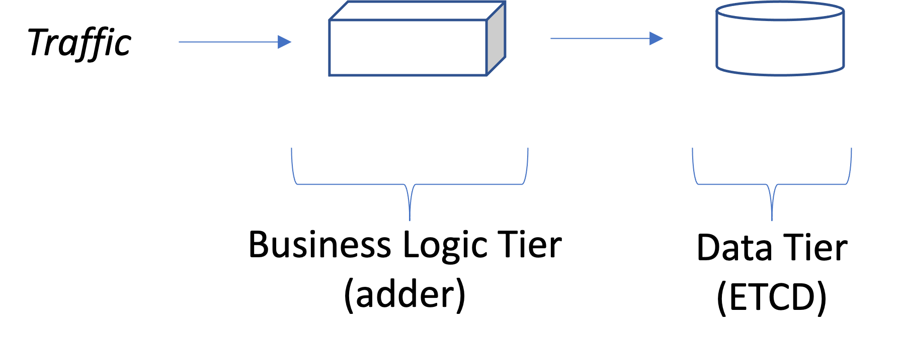
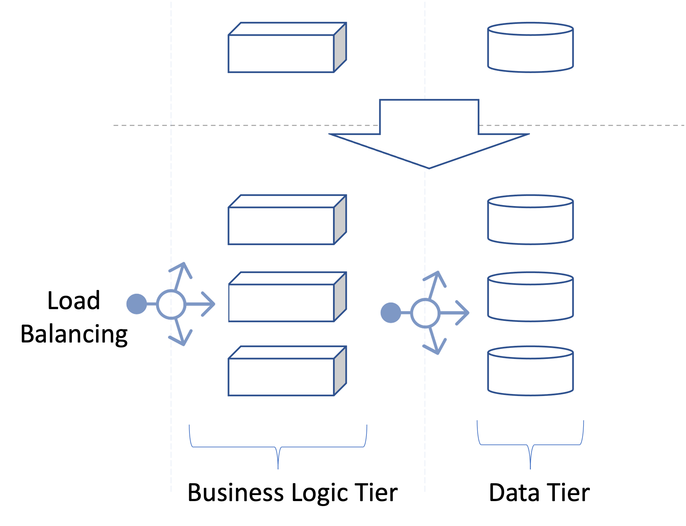

# Highly Available Counter Application

This repo includes an example of making an application highly available (HA) by leveraging Kubernetes (K8s).

The application logic is straight forward. It is basically an HTTP server that exposes an API to increment a counter, and then connects to an Etcd database where it stores the value of the counter.




## Prerequisit

start by cloning the repo:

```sh
git clone git clone git@github.com:akanso/ha-counter.git
```
make sure you have a functioning k8s cluster to deploy our pods to. [Minikube](https://minikube.sigs.k8s.io/docs/start/) or [Kubeadm](https://kubernetes.io/docs/setup/production-environment/tools/kubeadm/create-cluster-kubeadm/) are both good options to easily install K8s.

make sure `kubectl` is properly configured

```sh
export KUBECONFIG=/path/to/kubeconfig.conf
```

## Short version of all what follows:

upload the image of this code to your registry:

```bash
make MY_REGISTRY=<e.g.:docker_ID> docker-build
make MY_REGISTRY=<e.g.:docker_ID> docker-push
```

deploy your app in K8s

```bash
make deploy
sleep 45 # giving enough time for pods to be ready
```
This should create a replicated counter and Etcd DB



check the created pods:

```bash
kubectl get pods
NAME                                 READY   STATUS    RESTARTS   AGE
nfs-server-pod                       1/1     Running   0          7h54m
etcd0                                1/1     Running   0          7h15m
etcd1                                1/1     Running   0          7h15m
etcd2                                1/1     Running   0          7h15m
counter-deployment-585cc6696-5jbv6   1/1     Running   0          82m
counter-deployment-585cc6696-8plvj   1/1     Running   0          82m
counter-deployment-585cc6696-4b8xp   1/1     Running   0          82m
```

test it out ...

```
for i in {1..6}; do  curl localhost:30180/static; sleep 1;  echo; done
```

use `<<worker_node_ip_address>>:30180` where worker_node_ip_address is the IP address of any worker node in your K8s cluster (kubect  get node -o wide). 

expected result:

```bash
{"content":"meaning of life = 42","message":"Status OK","node":"akanso-performance","pod":"counter-deployment-54754cc958-rcvsw"}
{"content":"meaning of life = 42","message":"Status OK","node":"akanso-performance","pod":"counter-deployment-54754cc958-rd7lj"}
{"content":"meaning of life = 42","message":"Status OK","node":"akanso-performance","pod":"counter-deployment-54754cc958-rd7lj"}
{"content":"meaning of life = 42","message":"Status OK","node":"akanso-performance","pod":"counter-deployment-54754cc958-rd7lj"}
{"content":"meaning of life = 42","message":"Status OK","node":"akanso-performance","pod":"counter-deployment-54754cc958-9mrvm"}
{"content":"meaning of life = 42","message":"Status OK","node":"akanso-performance","pod":"counter-deployment-54754cc958-rcvsw"}
```
We should see all three pods of our counter have responsded showing their pod-name, e.g. `"pod":"counter-deployment-54754cc958-rcvsw"`

## Under the hood

there are many steps that `make deploy` handles for you that you can also do manually one by one

### Step 1: Deploy ETCD

Etcd is deployed in an HA manner with 3 pods abstracted by 3 k8s-services. to deploy `etcd` use:

```sh
kubectl create -f config/etcd.yaml
```

OR

```sh
kubectl create -f config/nfs-option
```

The latter command deploys an NFS server to persist the Etcd snapshots, and deploys an 3 Etcd instances that mount a shared volume. Only the leader will create a backup snapshot when it is terminated.
 

you can test your etcd deployment by doing an `exec` into any etcd pod:

```sh
kubectl exec -ti etcd0 -- sh 
```

once inside the container, use `etcdctl` to set the key `foo` to value `bar`

```sh
etcdctl set foo bar
```

```sh
etcdctl get foo
```

you can also do a DNS lookup for the other etcd members

```sh
nslookup etcd1
```

you can expect to see

```sh
Name:      etcd1
Address 1: 10.152.183.131 etcd1.default.svc.cluster.local
```

type `exit` or control^c to quit the container.

Note you can also apply those commands in a non-interactive way, e.g.:

```sh
kubectl exec -ti etcd0 -- nslookup etcd1 
```

### Step 2: build and push your code to dockerhub (or any other container registry you are using)


```sh
docker build . -t <<docker-registry-id>>/counter:latest
docker push  <<docker-registry-id>>/counter:latest
```

### Step 3: deploy your Golang counter application

Our application is a simple counter, that exposes and http interface. Every time you query the http interface, the counter value is incremented in etcd.

Therefore, our simple counter need to connect to etcd. We pass the etcd configuration to our counter using a k8s `configmap`

```sh
kubectl create configmap etcd-config --from-literal=endpoints="http://etcd0:2379,http://etcd1:2379,http://etcd2:2379"
```

now we can create our application deployment of 3 replicas, and passing the needed infomation using environment variables.

Note: we will set those environment variables using the k8s downward API and the configmap:

```yaml
env:
- name: MY_POD_NAME
  valueFrom:
    fieldRef:
      fieldPath: metadata.name
- name: MY_POD_NAMESPACE
  valueFrom:
    fieldRef:
      fieldPath: metadata.namespace
- name: MY_NODE_NAME
  valueFrom:
    fieldRef:
      fieldPath: spec.nodeName
- name: ETCD_ENDPOINTS
  valueFrom:
    configMapKeyRef:
      # The ConfigMap containing the value you want to assign to ETCD_ENDPOINTS
      name: etcd-config
      # Specify the key associated with the value
      key: endpoints
```

before creating our deployment, we will create a k8s service of type `NodePort` to load balance traffic among our components:

```bash
kubectl create -f config/counter-svc.yaml
```

check that service is created:

```bash
kubectl get svc
```

you can create our deployment (make sure your image name is set properly):

```bash
kubectl create -f config/counter-deploy.yaml
```

check that all the pods of the deployment are running:

```bash
kubectl get pods
```

### Step 4: generate some traffic to our application

```bash
for i in {1..60}; do  curl  localhost:30180/healthz;sleep 1; echo ; done
{"content":"etcd members = 3","message":"Status OK","node":"akanso-performance","pod":"counter-deployment-54754cc958-rd7lj"}
{"content":"etcd members = 3","message":"Status OK","node":"akanso-performance","pod":"counter-deployment-54754cc958-rcvsw"}
{"content":"etcd members = 3","message":"Status OK","node":"akanso-performance","pod":"counter-deployment-54754cc958-rd7lj"}
{"content":"etcd members = 3","message":"Status OK","node":"akanso-performance","pod":"counter-deployment-54754cc958-rd7lj"}
{"content":"etcd members = 3","message":"Status OK","node":"akanso-performance","pod":"counter-deployment-54754cc958-rcvsw"}
{"content":"etcd members = 3","message":"Status OK","node":"akanso-performance","pod":"counter-deployment-54754cc958-rd7lj"}
{"content":"etcd members = 3","message":"Status OK","node":"akanso-performance","pod":"counter-deployment-54754cc958-9mrvm"}
```

Use localhost or the node ip address of any of your k8s cluster worker nodes


```bash
for i in {1..6}; do  curl localhost:30180/increment; echo; done
{"content":"count value = 13","message":"Status OK"}
{"content":"count value = 14","message":"Status OK"}
{"content":"count value = 15","message":"Status OK"}
{"content":"count value = 16","message":"Status OK"}
{"content":"count value = 17","message":"Status OK"}
{"content":"count value = 18","message":"Status OK"} 
```

Note: the load will eventually be balanced accross all 3 instances of our deployment.

Finally, the coutner readiness probe assume Etcd is deployed, accessible and healthy, otherwise the counter pods will remain in a Not-ready state as follows:

```sh
Without the Etcd pods, we can see that our counter pods are not ready
```sh
kubectl get pods
NAME                                  READY   STATUS    RESTARTS   AGE
nfs-server-pod                        1/1     Running   0          32m
counter-deployment-54754cc958-rcvsw   0/1     Running   0          17m
counter-deployment-54754cc958-rd7lj   0/1     Running   0          17m
counter-deployment-54754cc958-9mrvm   0/1     Running   0          17m
```

## Upgrade image:

make a change, create a new docker image with a new tag, e.g. `v2.0`

```
kubectl set image deployment/counter-deployment  counter=akanso/counter:v2.0 --record
kubectl rollout history counter-deployment 
```
--------------------------------------
## Test the performance of your counter
--------------------------------------
install `hey` to generate http traffic

```sh
sudo snap install hey
```

Below are the resources allocated to each counter pod

```
resources:
  limits:
    cpu: "1"
    memory: "1Gi"
```

Generate 100 requests with concurrency equal 3 to the /healthz endpoint. This request only reads from Etcd the member list, without using any shared locks or writing anything to Etcd.

We get a throughput of `Requests/sec: 5660.6635
`

```
hey -n 100 -c 3 -m GET http://localhost:30180/healthz

Summary:
  Total:        0.0175 secs
  Slowest:      0.0019 secs
  Fastest:      0.0003 secs
  Average:      0.0005 secs
  Requests/sec: 5660.6635
  
  Total data:   12177 bytes
  Size/request: 123 bytes

Response time histogram:
  0.000 [1]     |■
  0.000 [63]    |■■■■■■■■■■■■■■■■■■■■■■■■■■■■■■■■■■■■■■■■
  0.001 [28]    |■■■■■■■■■■■■■■■■■■
  0.001 [3]     |■■
  0.001 [0]     |
  0.001 [1]     |■
  0.001 [0]     |
  0.001 [0]     |
  0.002 [0]     |
  0.002 [0]     |
  0.002 [3]     |■■


Latency distribution:
  10% in 0.0004 secs
  25% in 0.0004 secs
  50% in 0.0004 secs
  75% in 0.0005 secs
  90% in 0.0006 secs
  95% in 0.0011 secs
  0% in 0.0000 secs
```

Next, we generate 100 requests with concurrency equal 3 to the /increment endpoint. This requests uses a shared lock, and writes into Etcd.

Below we see that we have a throughput of `Requests/sec: 43.0545`

```
hey -n 100 -c 3 -m GET http://localhost:30180/increment

Summary:
  Total:        2.2994 secs
  Slowest:      0.1969 secs
  Fastest:      0.0397 secs
  Average:      0.0687 secs
  Requests/sec: 43.0545
  
  Total data:   5247 bytes
  Size/request: 53 bytes

Response time histogram:
  0.040 [1]     |■
  0.055 [28]    |■■■■■■■■■■■■■■■■■■■■■■■■
  0.071 [47]    |■■■■■■■■■■■■■■■■■■■■■■■■■■■■■■■■■■■■■■■■
  0.087 [12]    |■■■■■■■■■■
  0.103 [2]     |■■
  0.118 [0]     |
  0.134 [2]     |■■
  0.150 [2]     |■■
  0.165 [3]     |■■■
  0.181 [0]     |
  0.197 [2]     |■■


Latency distribution:
  10% in 0.0473 secs
  25% in 0.0539 secs
  50% in 0.0617 secs
  75% in 0.0692 secs
  90% in 0.1228 secs
  95% in 0.1506 secs
  0% in 0.0000 secs
```

Finally, we hit the /static endpoint. Here we make no calls to Etcd and we achieved a throughput of `Requests/sec: 13775.7377`

```
hey -n 100 -c 3 -m GET http://localhost:30180/static

Summary:
  Total:        0.0072 secs
  Slowest:      0.0013 secs
  Fastest:      0.0001 secs
  Average:      0.0002 secs
  Requests/sec: 13775.7377
  
  Total data:   12573 bytes
  Size/request: 127 bytes

Response time histogram:
  0.000 [1]     |
  0.000 [86]    |■■■■■■■■■■■■■■■■■■■■■■■■■■■■■■■■■■■■■■■■
  0.000 [8]     |■■■■
  0.000 [1]     |
  0.001 [0]     |
  0.001 [0]     |
  0.001 [0]     |
  0.001 [0]     |
  0.001 [0]     |
  0.001 [1]     |
  0.001 [2]     |■


Latency distribution:
  10% in 0.0001 secs
  25% in 0.0001 secs
  50% in 0.0002 secs
  75% in 0.0002 secs
  90% in 0.0002 secs
  95% in 0.0004 secs
  0% in 0.0000 secs
```
Performance conclusion:

endpoint | /healthz | /increment | /static |
--- | --- | --- | --- |
Req/Seconds | 5660 | 43 | 13775 |
